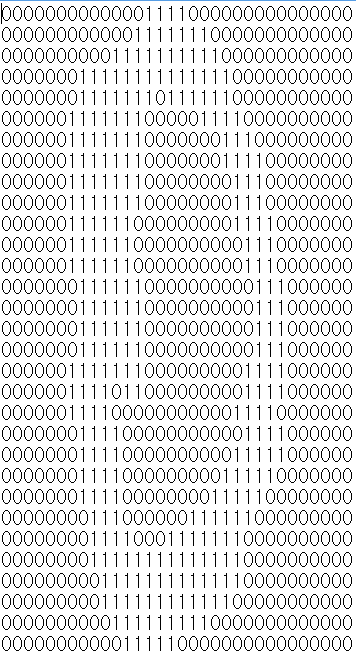

# KNN (K Nearest Neighbor)
implemented by python3

## 정의
데이터의 feature가 x1,x2,x3, ... ,xn 으로 주어지고 각각의 tuple에 대한 class label이 정해졌을 때 dataset을 D라 하면
임의의 데이터 tuple(test-data)에 대해K개 만큼의 인접 데이터들로부터 가장 많은 class label으로 해당 데이터의 class label을 예측하는 분류기법.

### 거리
이때 데이터간 인접했다는 것은 두 데이터간 '거리'가 최소임을 말한다.
거리는 두 데이터간 similarity를 의미하며 데이터가 가진 feature의 종류에 따라서 similarity 평가방법이 달라진다.

### feature의 종류
1. nomial
- property value간에 우선순위나 순서가 존재하지 않는경우. ex)색깔
2. binary
- Yes or No 또는 1 or 0 으로 두개의 데이터로 갈라지는 경우. ex)질병 양성/음성판정
3. ordinal
- 순서형 데이터형식. ex) 학년
4. numeric(continuous)
- 데이터의 수치를 표현할 수 있는 형식. ex) salary

## 구현
위 예제에서 사용하는 데이터는 모든 feature가 numeric type이므로 거리측정방법으로 유클리드 거리, 맨해튼 거리,민코브스키 거리, 최소상계거리 측정법을 사용할 수 있다. 본 예제에서는 데이터간 유사성(similarity)측정방법으로 유클리드거리,Euclideandistance 를 사용하도록 한다.

## 데이터 전처리
유클리드 거리를 사용하는 경우, 데이터가 가진 feature를 각 column별로 normalization할 필요가 있는데, 이유는 다음과 같다.
ex) 임의의 데이터의 feature를 하루 물섭취량(L),봉급(원) 이라 하자.
tuple01 : 20,3,000,000
tuple02 : 10,2,500,000
위와 같은 꼴로 나타내어진다. 그런데, 위 데이터를 정규화하지 않고 그대로 사용한다면,봉급(원) feature가 하루 물섭취량(L) feature에 비해 값의 절대량이 크므로 데이터간 유사성측정으로 유클리드 거리를 계산하고 자 할때 distance의 값이 봉급(원) feature에 의해서만 dominant하게 결정되어지고 나머지 column인 하루 물 섭취량(L)는 무시되어진다.
따라서, 위 문제에대한 해결책으로 각 feature들에 대해서 normalization하고 test-tuple도 같은 방식으로 정규화하여 classify를 진행한다. feature들은 classfier구현방식에 따라 각기 가중치를 지니게하여 어떠한 feature가 class label을 critical하게 결정하는 정도를 구현할 수 있는데, 본 예제에서는 모든 feature간에 가중치가 동일하다고 설정하였다.

### normalization code
<pre><code>
def normalization(dataset):
    '''
    :param dataset: un-normalized dataset
    :return: normalized-dataset, minVals,ranges that used to normalize test-tuple
    '''
    minVals = dataset.min(axis=0) # get min values by column (vector)
    maxVals = dataset.max(axis=0) # get max values by column (vector)
    ranges = maxVals-minVals # get ranges (vector) It means max-min
    m = dataset.shape[0]
    normMatrix = dataset - np.tile(minVals,(m,1))
    normMatrix = normMatrix / np.tile(ranges,(m,1))
    return normMatrix, minVals,ranges
</code></pre>

## KNN classifier 주요 소스코드
<pre><code>
def predict(sample,normDataset,labels,minVals,ranges,k):
    # ...위 코드 생략...
    # calculate distance between testTuple and objects -- Euclidean distance
    difMatrix = np.tile(sample,(m,1)) - normDataset
    difMatrix = difMatrix ** 2 # square
    distances = difMatrix.sum(axis=1)
    distances = distances ** 0.5
    ascendingIndice = distances.argsort()
    classCount = collections.defaultdict(int)
    for i in range(k):
        matchedLabel = labels[ascendingIndice[i]]
        classCount[matchedLabel] +=1
    sortedClassCount = sorted(classCount.items(), key=operator.itemgetter(1), reverse=True)
    return sortedClassCount[0][0]
</code></pre>
1. test-tuple과 dataset의 모든 데이터간에 거리를 유클리드 거리측정법으로 계산한뒤,
2. 구해낸 distance를 오름차순으로 정렬한다.
3. distance의 첫번째 index부터 test-tuple과 유사성이 높은것을 의미하므로, k개 만큼 데이터를 pop하여 해당 데이터가 나타내는 class label을 카운팅한다.
4. 가장 많이 카운팅된 class label을 해당 test-tuple에 대한 prediction 값으로써 반환한다.

## MNIST Example
주어진 데이터는 32*32로 0 또는 1을 작성하여 class label 0-9를 나타내었다.
이러한 데이터로 부터 dataset을 다음과 같이 디자인한다.
m : the nubmer of instances
dataset = np.array((m,1024)) # 1024 = 32*32
아래와 같은 MNIST 데이터를 1024개의 binary input feature로 정의한다.
binary feature인 경우, Euclidean distance를 사용해 similarity를 계산하고자 하면 하나의 속성값을 0, 나머지 속성값을 1로 mapping하여 거리측정을 진행한다. 주어진 예제에서는 이러한 과정이 선행되어있어 코드에서는 해당 부분을 다루지 않았느나 일반적인 경우 binary feature인 경우 위와 같이 처리한다.
단, binary feature에 해당하는 값이 대칭속성인 경우에만 사용할 수 있고 질병 양성판정/ 음성판정과 같은 비대칭속성인 경우에는 numeric feature의 distance처럼 Euclidean distance를 사용할 수 없고 Jaccard coeffient를 사용한다.

### example

### MNIST Example 실행코드
<pre><code>
dataSet,labels = kNN.getTrainingDataSet_MNIST()
testDataSet,testLabels = kNN.getTestDataSet_MNIST()
print(kNN.getAccuracy(testDataSet,testLabels,dataSet,labels,3))
</code></pre>
